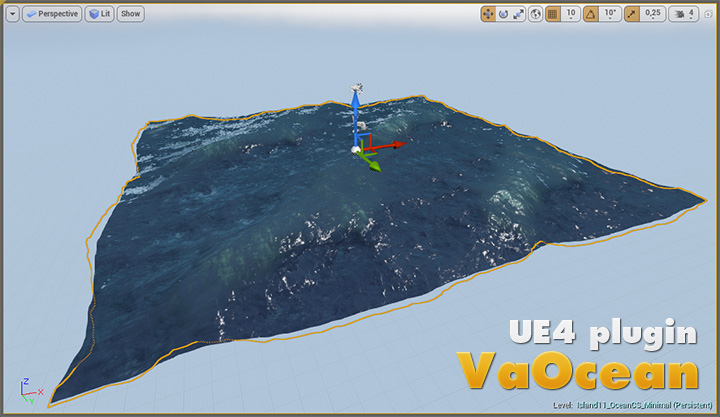

Welcome to the VaOcean source code!
===================================

VaOcean is the ocean surface simulation plugin for [Unreal Engine 4](https://www.unrealengine.com/).

The plugin includes:

* Component that renders displacement and gradient (normal) maps in real time
* Sample content, including water shader and grid meshes to be used on scene
* Set of global shaders that perform FFT calculation and other tech stuff on GPU

Plugin is actively used in [SeaCraft](http://seacraft.sc) project development.

Current version: **0.4 Alpha 6**

Features
--------

Some key things you should know about the VaOcean:

* Based on Jerry Tenssendorf’s paper "Simulating Ocean Water"
* Displacement is generated from Phillips spectrum (statistic model), processed by [fast Fourier transform](http://en.wikipedia.org/wiki/Fast_Fourier_transform)
* Spectrum per-frame update, FFT and displacement map generation are performed on GPU (it's really fast!)
* Currently algorythm uses only 512x512 maps
* Ocean shading is running as material shader

Ocean material shader is quite simple, and can be easily extended to fit your requirements. Current shading components:

* Water body color: using near, mid and fat color mixed by Fresnel term
* Perlin distance-based noise applied both to normals and displacement to remove pattern tiling artifacts
* UE4 screen-space dynamic reflections. It's not the best way to handle a reflection for waves, but the only one we can use with dynamic objects like warships and VFXs now
* Waves **subsurface scattering**, based on fake LightVector. To use it right way, you should pass your scene's sun location vector to material instance via blueprints.

Futher improvements are on the way! Energy-based foam, physics body reaction (like FluidSurface in UE3/UDK), splashes and bursts, rigid body swimming simulation and even more!

Legal info
----------

Unreal® is a trademark or registered trademark of Epic Games, Inc. in the United States of America and elsewhere.

Unreal® Engine, Copyright 1998 – 2014, Epic Games, Inc. All rights reserved.

References
----------

1. Tessendorf, Jerry. Simulating Ocean Water. In SIGGRAPH 2002 Course Notes #9 (Simulating Nature: Realistic and Interactive Techniques), ACM Press.

1. Phillips, O.M. 1957. On the generation of waves by turbulent wind. Journal of Fluid Mechanics. 2 (5): 417–445.

